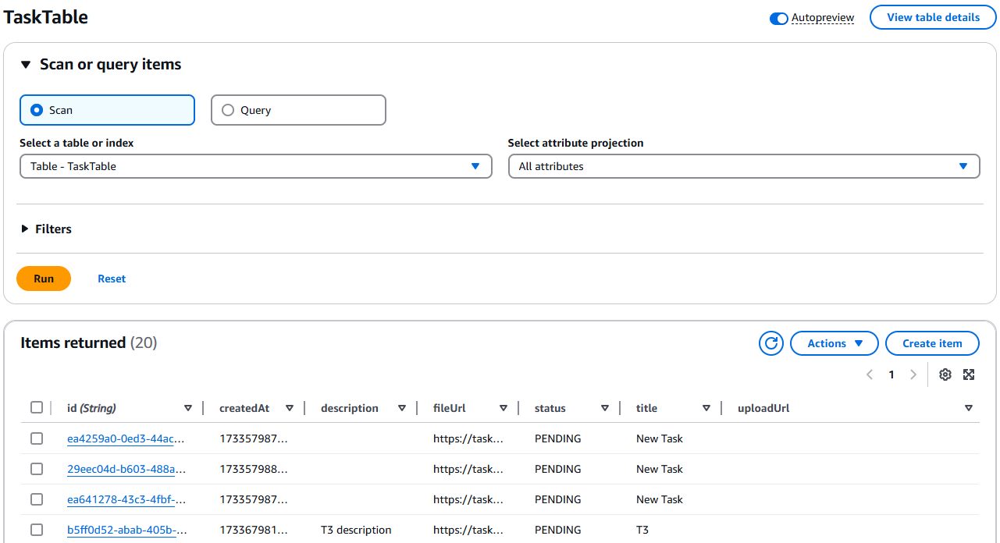
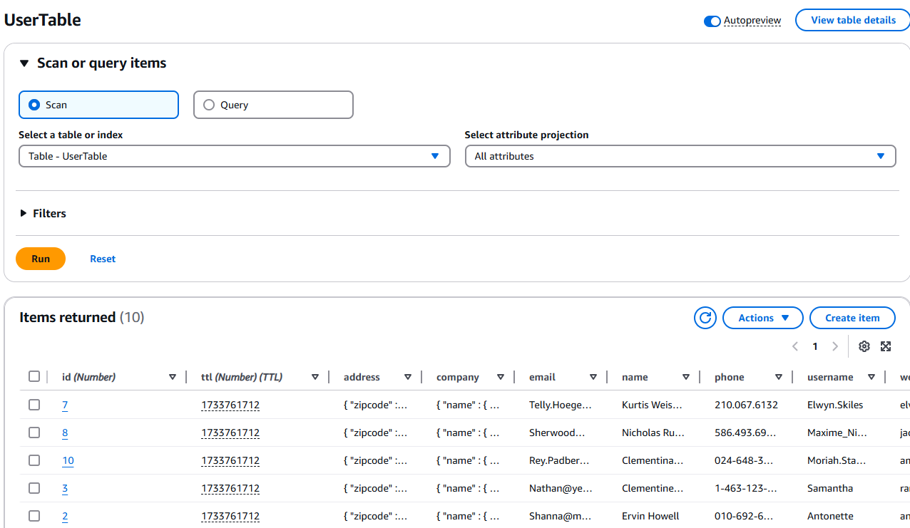
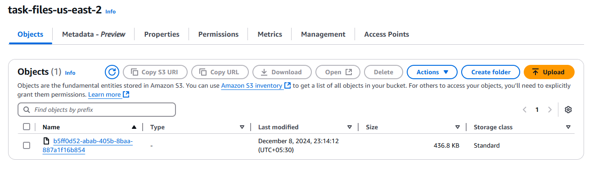
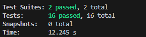

# Task Management Application

###### **Current version: v1.0.0**

## Overview
In this project, the following tech stack is used. You can find other package versions in the package.json file.

- `NPM: 10.9.0`
- `Node: 22.12.0`
- `Typescript: 5.5.3`
- `Express: 4.19.2`

## Run Application

Create .env file in the task-app-backend directory refering to .env.example file.

### Option 1: Running without Docker

You can get started easily by running the following commands from task-app-backend directory. 

        npm install
        npm run build
        npm run start

Then your backend application will start running on `3000` as per the .env file.

### Option 2: Running with Docker

Run the following command from task-app-backend directory and build the docker image.

        docker build -t task-app .

Now you can run the following command to get the container up and running locally on `3000` port. Here point your .env file with --env-file tag. 

        docker run --env-file .env -p 3000:3000 task-app

Now, time to enjoy managing the tasks with the API!

## Technology Overview

This application is developed with NodeJs(Typescript) and Express. AWS DynamoDB is used as the database. The database is configurable with the Factory design pattern implementation so that you can use InMemory cache only. For usnit testing, you can run it with mock task service.

##### Snapshot of Tasks Table

##### Snapshot of Users Table

##### Snapshot of S3 Bucket

##### Unit Testing with Jest
Unit testing is implementated with `Jest` with mocking service `MockTaskService.

## Usage

Go to `http://localhost:3000/docs` for the api documentation. If you want to access the hosted API, contact the [developer](https://github.com/bumuthu).

Make sure to change host url with ip address and port before executing the API.

Browse to [task-app-deployment.](https://github.com/bumuthu/task-management-app/tree/main/task-app-deployment) in order to deploy Docker container to AWS ECR.

