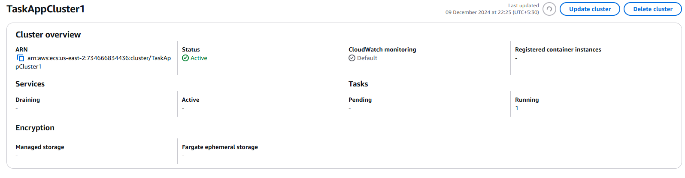
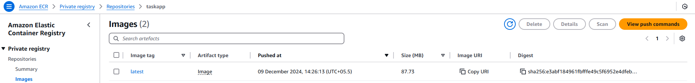
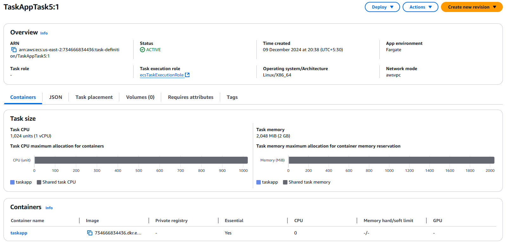
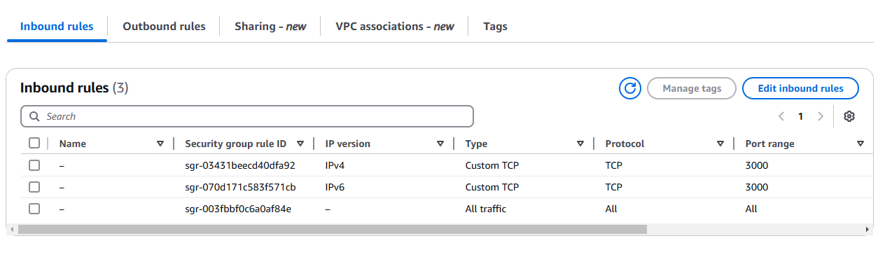
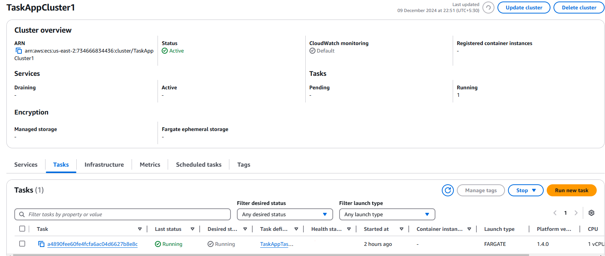
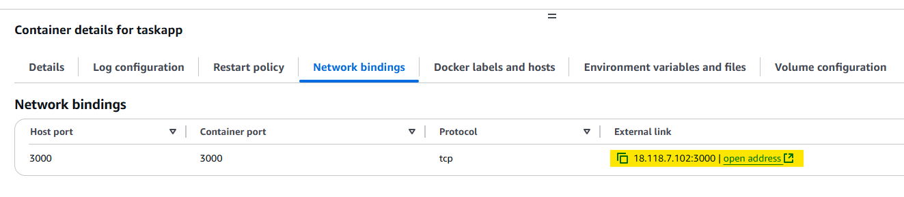

# Task Management Application Deployment

###### **Current version: v1.0.0**

## Environment Provisioning Steps

### 1. AWS IAM User Creation

Create an IAM user with CLI access in order to create DynamoDB tables using AWS Management Console. Hereby I attach `AmazonDynamoDBFullAccess` and `AmazonS3FullAccess` in order to grant for all the actions including DynamoDB table create, list, update, read, and S3 file read, write, etc.

Then create Access Keys for the IAM user in AWS Management Console. 

Make sure to export the Aceess Key and Scret Key in the terminal before running the AWS CLI commands.

### 2. AWS DynamoDB Table Creation

Install AWS CLI following these [instructions.](https://docs.aws.amazon.com/cli/latest/userguide/cli-chap-getting-started.html)

Now, run the following commands to provision DynamoDB tasks & users tables as per the definitions. Then update the ttl for users table.

        aws dynamodb create-table --cli-input-json file://dynamodb-tables/tasks-table-schema.json
        aws dynamodb create-table --cli-input-json file://dynamodb-tables/users-table-schema.json
        aws dynamodb update-time-to-live --table-name UserTable --time-to-live-specification "Enabled=true, AttributeName=ttl"

Now, run this and check whether the tables are created in the account.

        aws dynamodb describe-table --table-name TaskTable
        aws dynamodb describe-table --table-name UserTable

### 3. S3 Bucket Creation

Create S3 Bucket to enable file uploads with presigned URL.

        aws s3api create-bucket --bucket task-files-us-east-2 --region us-east-2 --create-bucket-configuration LocationConstraint=us-east-2

## Container Deployment on AWS ECS (Fargate)

### 1. Create ECS Cluster

Create the AWS ECS cluster with AWS Fargate (serverless) infrastructure using AWS management console. Things to choose AWS ECR with Fargate.

- Serverless and Simplified Management: Fargate eliminates the need to provision, manage, or scale EC2 instances. It automatically handles the infrastructure, allowing solely deploying and managing containers.

- Cost-Efficiency for Variable Workloads: Fargate charges based on the exact resources (vCPU and memory) allocated to the containers, rather than the full capacity of EC2 instances, making it more cost-effective for variable or unpredictable workloads.

### 2. Create Task Definition

Create task definition with following configurations.
- Sufficient resources (CPU and Memory)
- Locate ECR image pushed in Github action pipeline.

- Port mapping from `3000:3000`
- Add env variables
- (Optional) Configure health check endpoint

### 3. Run Task in Cluster

Run the created Task in the cluster. Here make sure to attach security group with allows all the inbound traffic.

Security group's inbound traffic is as this.

Running task is as this.

Now, open this ip with `3000` port to access the API.

